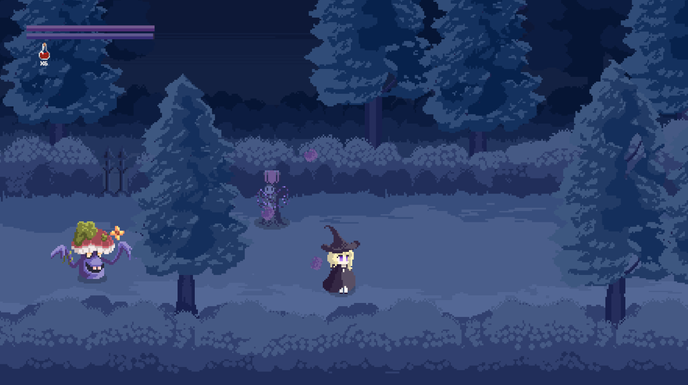
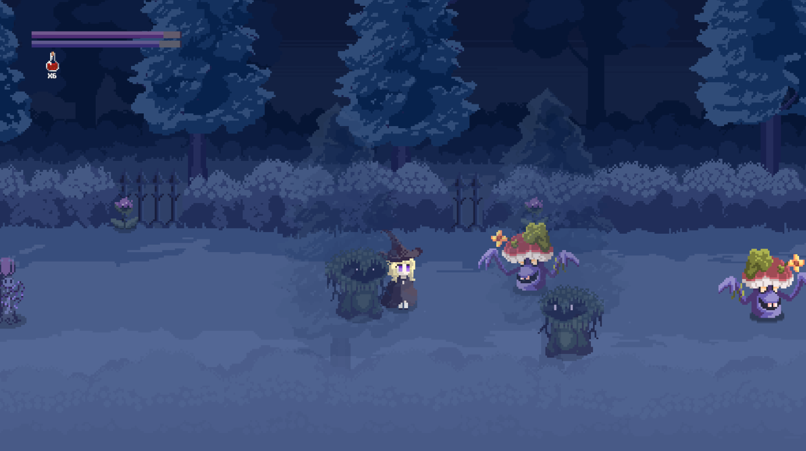
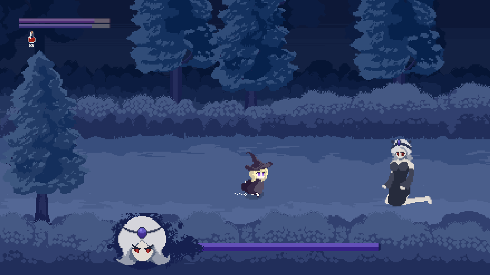
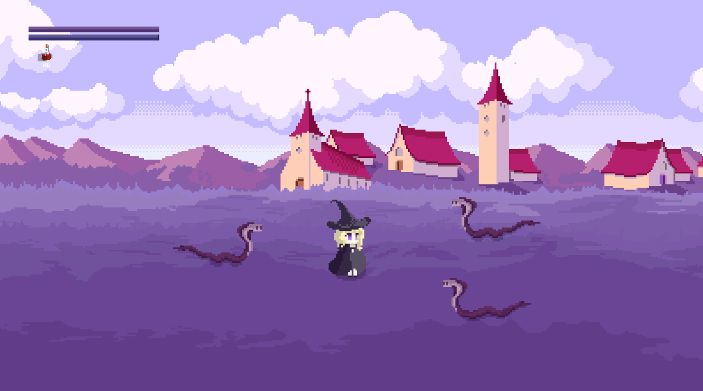

# 类DOTA的2D横版ARPG游戏

  <b>手搓小项目，用于Unity引擎学习</b>

## 📖 简介
本科期间摸鱼小项目，使用Unity引擎实现的2D横版动作角色扮演游戏 
vers:Unity 2022.3.53f1c1 C# 

## 一些截图
 
 
 
 
## ✨ 应用的杂七杂八的功能
### 对象池（Object Pool）管理
管理游戏中高频生成/销毁的实体 
用于优化游戏中大量生成销毁的实体、弹幕，提升性能，避免频繁创建/销毁对象带来的内存开销

### AI逻辑
有限状态机(FSM) 
将实体行为分割为多个独立State用于降耦（全部写在Monobehavior的Update()函数里耦合会爆表的喵_(:з」∠)_） 
行为树 
树形结构用于优化状态增多导致复杂的状态机转换逻辑 

小怪用FSM，BOSS用行为树 

### UI+数据
通用UI框架，背包、血条、任务面板等都是复用的这个框架 
进度PlayerPrefs存储（这个存小规模数据比较方便，大规模的数据还是用json吧） 

### 计划中的新功能
URP管道渲染（更好的光影表现效果） 
异步场景加载（是的我偷懒了因为只有两三个场景） 
寻路算法改进（游戏场景暂时没有设置障碍物，AI寻路是两点之间线段最短）（A*）

你可以： 
-For 数媒/VR/软工——参考我的游戏作为毕设的灵感(如果你不嫌弃我的代码史的话，这个项目作为毕设完全够用:-P) 
你不可以： 
-拿我画的素材去卖钱 
-直接原封不动地告诉老登这个是你做的 
